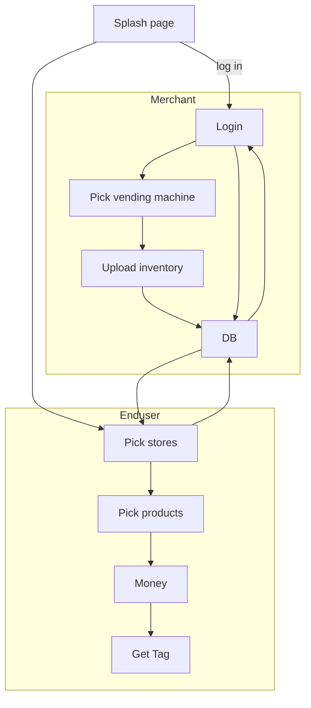

# dispense_version3
https://github.com/mulefish/dispense_version3

# DB 
Postgres
pgadmin
tables: 
vending 

# DB Local machine commands: 
pmontgomery@FVFH51FAQ6LW bin % brew services stop postgresql
#(base) pmontgomery@FVFH51FAQ6LW bin % brew services start postgresql
#(base) pmontgomery@FVFH51FAQ6LW bin % psql -U pmontgomery -H

# DB TODO: 
1 - settle on a DB schema 
2 - Get more solid on Google Cloud DB 
3 - Port local DB to Google Cloud DB 

# Flow

