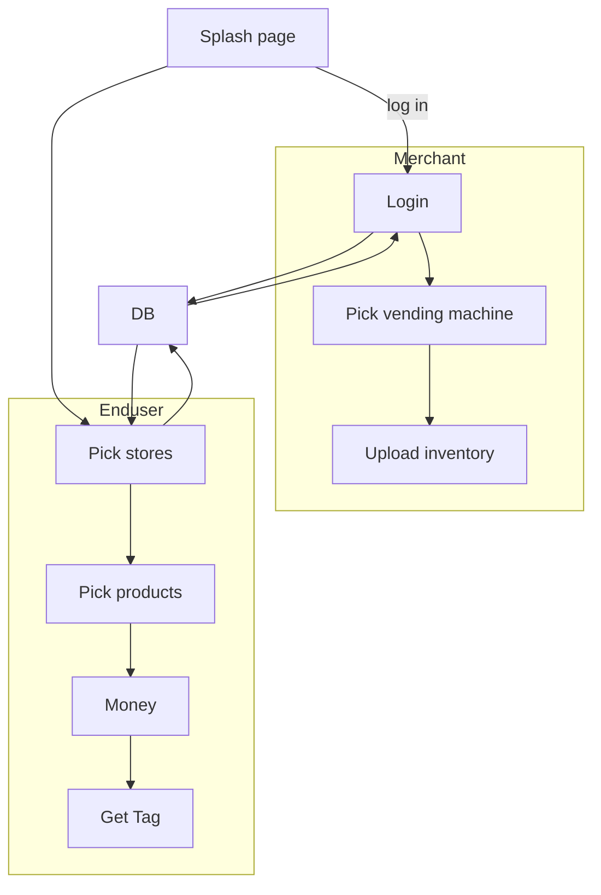

# dispense_version3
https://github.com/mulefish/dispense_version3

# Flow

```mermaid
    flowchart TB
    A[Splash page]
    B[Login]
    DB[DB]
    D[Pick stores]
    E[Pick products]
    F[Money]
    G[Get Tag]
    H[Pick vending machine]
    I[Upload inventory]


    A-- log in -->B
    subgraph Merchant
        B-->H
        H-->I
    end
    
    A-->D
    subgraph Enduser
        D-->E
        E-->F
        F-->G
    end
    D-->DB
    DB-->D

    B-->DB
    DB-->B

```
